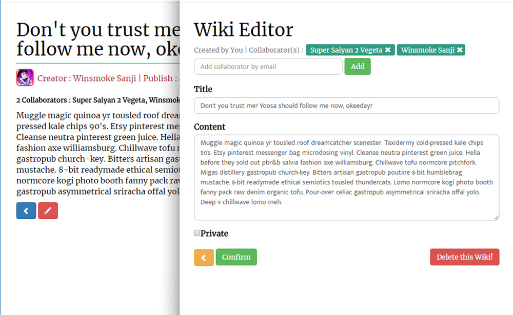

# Blocipidia

## Introduction
This community wiki platform was built using Ruby on Rails and Bootstrap. It utilizes a PostgreSQL database to store user information, wiki content, and permissions, privacy, and payment information, leveraging ORM capability to map and use the stored data. Blocipedia also integrates many useful gems, including Redcarpet, Stripe, Paperclip, Pundit, Devise, and more.

This application was release on Heroku app platform as a demo version. You can descover more by follow the [link](#demo) below.

### Description
With Blocipedia, users can create their own public wikis, edit others, and even add pictures. However, if they want to up the ante, they can sign up for a (free) premium membership, which gives them the ability to create private wikis and invite collaborators to join them if they choose.

### Project objective
Blocipedia is my first Ruby application and on development, but shows my skill in building useful and usable applications from the backend to the frontend.

### Screenshot

Log in page

After authenticated user credential the app will be redirect to wikis index page.

Standard user can view and edit other wikis but only delete their own.

## Version
v0.01

## Demo
You can checkout Pomotimer by follow this link [here](https://floating-fortress-24752.herokuapp.com/). 

## Sending Feedback
I am always open to [your feedback](https://github.com/bakhumhlea/blocipidia/issues).
